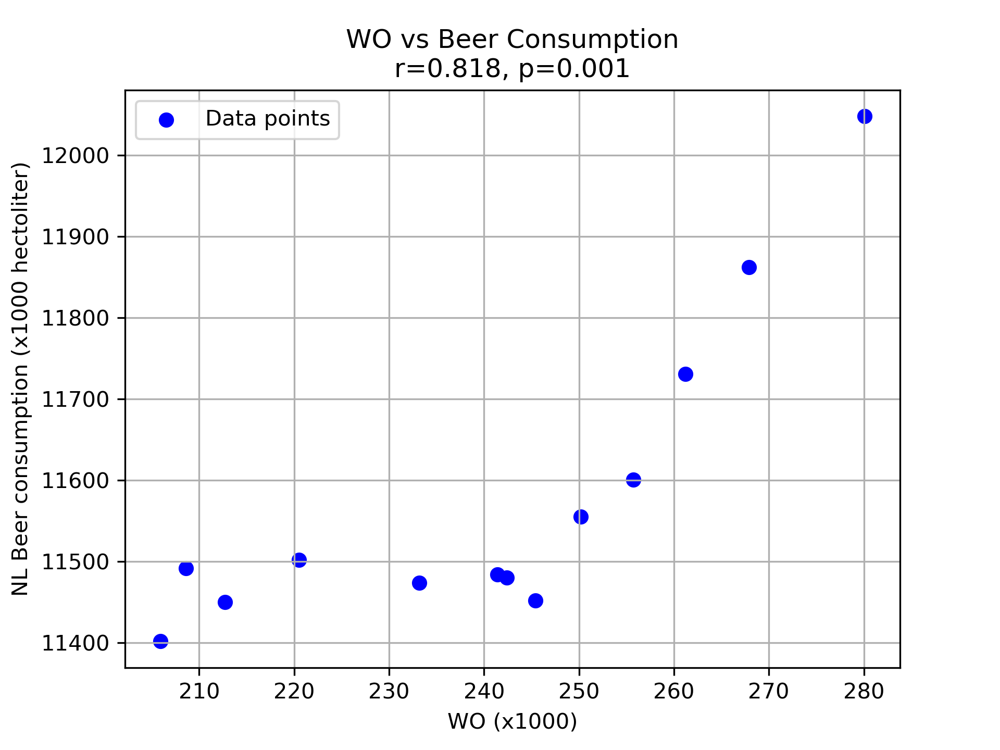

student id: 16484800

- MCC Van Dyke et al., 2019
- JT Harvey, Applied Ergonomics, 2002
- DW Ziegler et al., 2005

I used the Pearson correlation to test the link between WO and beer consumption. I found a positive correlation (r = 0.818, p = 0.001), meaning both rise together.
